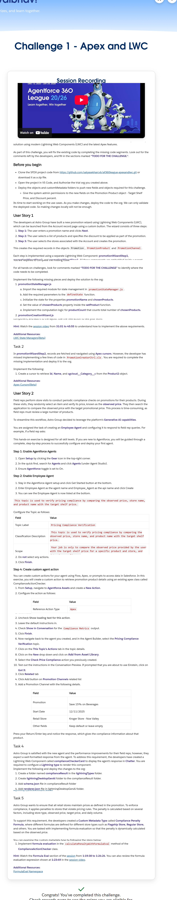

Challenge 1 - Apex and LWC
Session Recording
Watch this video to understand the concepts that you will work with in this hands-on challenge.

Complete image for challenge 1 demo is below:     = press control then click

Hands-On Challenge
Introduction
A team of Salesforce developers and administrators has configured Salesforce Consumer Goods Cloud and implemented initial customizations for a consumer goods company. You are tasked with enhancing the existing solution using modern Lightning Web Components (LWC) and the latest Apex features.

As part of this challenge, you will fix the existing code by completing the missing code segments. Look out for the comments left by the developers, and fill in the sections marked “TODO FOR THE CHALLENGE.”.

Before you begin
Clone the SFDX project code from https://github.com/satyasekharcvb/af360league-apexandlwc.git or download it as a zip file.
Open the project in VS Code, and Authorize the trial org you created above.
Deploy the objects and customMetadata folders to push new fields and objects required for this challenge.
Give the system admin permissions to the new fields on the Promotion Product object - Target Shelf Price, and Discount percent.
Add the new fields to the page layout of the Promotion Product object.
Explore Consumer Goods Cloud app
Using App Launcher, open Consumer Goods Cloud.
Navigate to the different tabs like Retail Stores, Retail Store Groups and Promotions.
Open any promotion, and look at the details, and related records like Promotion Products and Promotion Channels.
Update a Promotion Product to include the new fields you just deployed above.
Its time to start working on the use cases. As you make changes, deploy the code to the org. We can only validate the deployed code. So making changes locally will not be enough.

User Story 1
The developers at Astro Group have built a new promotion wizard using Lightning Web Components (LWC), which can be launched from the Account record page using a custom button. The wizard consists of three steps:

Step 1: The user enters a promotion name and clicks Next.
Step 2: The user selects a list of products and specifies the discount to be applied as part of the promotion.
Step 3: The user selects the stores associated with the Account and creates the promotion.
This creates the required records in the objects Promotion, PromotionProduct and PromotionChannel.

Each step is implemented using a separate Lightning Web Component: promotionWizardStep1, promotionWizardStep2, and promotionWizardStep3. All these components are embedded inside a parent component called promotionCreationWizard.

Tip: You can review the functionality by watching the session video between 21:09 and 31:01.

Task 1
State management for the new promotion wizard is implemented in the promotionStateManager component (promotionStateManager.js). However, the developer has missed implementing some parts of this module. You are required to complete the missing code.

For all hands-on challenges, look for comments marked “TODO FOR THE CHALLENGE” to identify where the code needs to be completed.

Implement the following missing pieces and deploy the solution to the org:

promotionStateManager.js
Import the required module for state management in promotionStateManager.js.
Add the required parameters to the defineState function.
Initialize the state for the properties promotionName and chosenProducts.
Set the value of chosenProducts property inside the setProduct function.
Implement the computation logic for productCount that counts total number of chosenProducts.
promotionCreationWizard.js
Import and Initialize the state manager in promotionCreationWizard.js.
promotionWizardStep1.js
Import the modules to inherit the state manager into promotionWizardStep1.js.
Inside the allValid() function update the state with the new value for promotionName.
promotionWizardStep2.js
Import the modules to inherit the state manager into promotionWizardStep2.js.
Once done, deploy the components. Create an action on the Account object for the promotionCreationWizard component, and add it to the layout. Use the new action to test your work!

Hint: Watch the session video from 31:01 to 45:55 to understand how to implement the above requirements.

Additional Resources:

LWC State Managers(Beta)

Task 2
In promotionWizardStep2, records are fetched and navigated using Apex cursors. However, the developer has missed implementing a few lines of code in PromotionCreatorCtrl.cls. You are required to complete the missing implementation and deploy it to the org.

Implement the following:

Create a cursor to retrieve Id, Name, and cgcloud__Category__c from the Product2 object.
If an existing cursor locator is being sent as a parameter, then deserialize the cursor and use the same.
If the locator is NOT sent as a parameter, then create a new cursor.
Define a variable to store and retrieve the countToFetch value - it is the lesser value either the page size, or the remaining records.
Fetch the records and store them in result.records.
Send the created cursor to LWC using result.locator so that you can reuse it.
Hint: Pause the video at 52:52 and examine the code to understand how the implementation should work.

Additional Resources:

Apex Cursors(Beta)

User Story 2
Field reps perform store visits to conduct periodic compliance checks on promotions for their products. During these visits, they randomly select an item and verify its price, known as the observed price. They then search the application to compare the observed price with the target promotional price. This process is time-consuming, as field reps must review a large number of products.

To streamline this workflow, Astro Group decided to leverage the platform’s Generative AI capabilities.

You are assigned the task of creating an Employee Agent and configuring it to respond to field rep queries. For example, if a field rep asks:

“I am at the Kroger Store – Noe Valley. The price of water is $1.00. Is that correct?”

The agent should validate the information and respond whether the product price is compliant with the applicable promotion. This solution helps save significant time, effort, and cost for the organization.

Tip: You can review the functionality by watching the 5-minute demo in the session video between 1:11:00 and 1:16:00.

Task 3
This hands-on exercise is designed for all skill levels. If you are new to Agentforce, you will be guided through a complete, step-by-step process to successfully configure and deploy your first agent.

Step 1: Enable Agentforce Agents
Open Setup by clicking the Gear icon in the top-right corner.
In the quick find, search for Agents and click Agents (under Agent Studio).
Ensure Agentforce toggle is set to On.
Step 2: Enable Employee Agent
Stay in the Agentforce Agent setup and click Get Started button at the bottom.
Enter Employee Agent as the agent name and Employee_Agent as the api name and click Create
You can see the Employee Agent is now listed at the bottom.
Step 3: Configure the Agentforce Employee Agent
Configure the agent with topics and actions that it can use to support the employees.

In the quick find, search for Agents and click Agents (under Agent Studio).
On the Agents page in setup, click on the Employee Agent.
Click Open in Builder button
In Agent Builder, click on the New drop down and click on New Topic.
Enter the following description for What do you want this topic to do? (Optional)
This topic is used to verify pricing compliance by comparing the observed price, store name, and product name with the target shelf price.

Configure the Topic as follows:

Field	Value
Topic Label	Pricing Compliance Verification
Classification Description	This topic is used to verify pricing compliance by comparing the observed price, store name, and product name with the target shelf price.
Scope	Your job is only to compare the observed price provided by the user with the target shelf price for a specific product and store, and determine compliance.
Instruction	You have access to an Apex Action called Check Price Compliance.
Use this action anytime the user asks about price correctness, target price, price gap, or compliance for a store and product.
Example	I am at the downtown store. The price of Cranberry Juice is $2.00. Is that correct?
Click on Next
Do not select any actions.
Click Finish.
Step 4: Create custom agent action
You can create custom actions for your agent using Flow, Apex, or prompts to access data in Salesforce. In this exercise, you will create a custom action to retrieve promotion product details using an existing apex class called ComplianceActionChecker.

From Setup, navigate to Agentforce Assets and create a New Action.
Configure the action as follows:
Field	Value
Reference Action Type	Apex
Reference Action Category	Invocable Method
Reference Action	Check Price Compliance
Agent Action Label	Keep default
Agent Action API Name	
Keep default
Click Next.
Uncheck Show loading text for this action.
Leave the default instructions in.
Check Show in Conversation for the Compliance Metrics output.
Click Finish.
Now navigate back to the agent you created, and in the Agent Builder, select the Pricing Compliance Verification topic.
Click on the This Topic's Actions tab in the topic details.
Click on the New drop down and click on Add from Asset Library.
Select the Check Price Compliance action you previously created.
Test out the instructions in the Conversation Preview. If prompted that you are about to use Einstein, click on Got It.
Click on the refresh button to reset the conversation.
Hint: For this challenge, you need to create the agent action from Agentforce Assets and not directly from within the agent builder. (Our validation logic specifically checks for exact API names, and creating an action from within agent builder appends a random id to the API name).

Step 5: Add some data for testing

Open Consumer Goods App from the App Launcher
Open Retail Stores tab and select Kroger Store - Noe Valley record.
Click Related tab
Click Add button on Promotion Channels related list
Add a Promotion Channel with the following details.
Field	Value
Promotion	
Save 15% on Beverages
Start Date	12/11/2025
Retail Store	Kroger Store - Noe Valley
Other fields	Keep default or leave empty
Step 6: Test your agent

In the quick find, search for Agents and click Agents (under Agent Studio).
On the Agents page in setup, click on the Employee Agent.
Click Open in Builder button
Enter this prompt in the dialog box
I am at the Kroger Store - Noe Valley. The price of water is $1.00. Is that correct?
Press your Return/Enter key and notice the response, which gives the compliance information about that product. 

Task 4
Astro Group is satisfied with the new agent and the performance improvements for their field reps; however, they expect a well-formatted response from the agent. To address this requirement, the developers have created a Lightning Web Component called complianceCheckerCard to display the agent’s response in Chatter. You are required to configure a Lightning type to render this component.

Implement the following and deploy the changes to the org:

Create a folder named complianceResult in the lightningTypes folder.
Create lightningDesktopGenAi folder to the complianceResult folder.
Add schema.json file in complianceResult folder
Add renderer.json file in lightningDesktopGenAi folder.
Define the schema with @apexClassType/c__ComplianceMetrics as the lightning:type.
Create the renderer to use the complianceCheckerCard component.
Define the target in complianceCheckerCard.js-meta file to expose this component to Agentforce Custom Lightning Types. Hint: target type is lightning__AgentforceOutput
Hint: Watch the session video from 1:06:53 to 1:19:28 to understand how to implement the above requirements

Additional Resources:

Lightning Types Developer Guide

Task 5
Astro Group wants to ensure that all retail stores maintain prices as defined in the promotion. To enforce compliance, it applies penalties to stores that violate pricing rules. The penalty is calculated based on several factors, including store type, observed price, target price, and daily volume.

To support this requirement, the developers created a Custom Metadata Type called Compliance Penalty Formula, where different formulas are defined for different store types such as Flagship Store, Regular Store, and others. You are tasked with implementing formula evaluation so that the penalty is dynamically calculated based on the observed price.

You can examine the custom metadata type by following the steps below:

Deploy the Custom Metadata Type object and records that are present in the repo.
Once deployed, in Setup, use Quick Find to search for Custom Metadata Types.
Select Compliance Penalty Formula.
Click Manage Compliance Penalty Formulas.
Select each store type and examine the defined formula.
You now need to implement the following and deploy it to the org:

Implement formula evaluation in the calculatePenaltyWithFormulaEval method of the ComplianceActionChecker class.
Hint: Watch the Formula Eval section of the session from 1:19:38 to 1:24:24. You can also review the formula evaluation expression shown at 1:23:49 in the session video.

Additional Resources:

FormulaEval Namespace